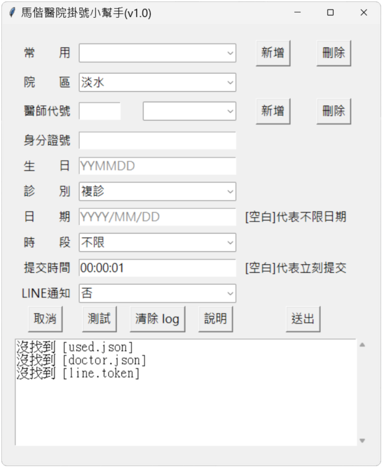

# autofill
功能 : 馬偕醫院自動掛號程式  
參考文件 : https://steam.oxxostudio.tw/category/python/spider/selenium.html  
實作文件 : https://bwm0822.github.io/doc/auto_registered.html

將專案下載後，依照以下步驟，就可以產生一個可執行檔(gui.exe)

1. 進入專案目錄

2. 建立 Python 虛擬環境 
python -m venv ./venv 

3. 啟動 Python 虛擬環境 
.\venv\Scripts\activate 

4. 安裝相關套件 
pip install -r requirements.txt 

5. 將程式打包為一個執行檔，執行檔會放在 \dist\gui.exe 
pyinstaller --onefile --noconsole --copy-metadata readchar gui.py 

<pre>
使用說明 :

選擇[院區]、[診別]、[時段]、[LINE通知]
填寫[醫師代號]、[身分證號]、[生日]、[日期]、[提交時間]
按[送出]鍵，則會啟動掛號流程

[時段]      不限：自動選取第一個可掛號的時段，
            上午、下午、晚間：只選取對應的時段
[日期]      空白：自動選取第一個可掛號的日期
[提交時間]  空白：立即掛號，否則等到提交時間才掛號
[測試]      用來驗證你的表單是否正確，如果表單正確，就可以連上醫師掛號的頁面，
            但不會掛號，
            按[測試]鍵會顯示網頁，可用來確認網頁是否正確，
            按[送出]鍵則不會顯示網頁，以加快執行速度及避免頁面被干擾

如何取得[醫師代號]
    進入 依醫師掛號 的頁面，觀察其網址(如下)，
    https://www.mmh.org.tw/register_single_doctor.php?
    depid=C7&did=1114&area=ts，
    其中 did=1114 的 1114 就是[醫師代號]

[新增]及[刪除]常用的設定
    [新增]功能：在[用戶]、[醫師代號]欄位的右邊按[新增]，會跳出視窗，
                輸入設定，按[確定]就可以新增設定
    [刪除]功能：選取[用戶]、[醫師代號]欄位的下拉式選單，並按欄位右邊的[刪除]鍵，
                即可[刪除]設定
    [用戶]的設定檔會存於執行檔同路徑下的 user.json，
    [醫師]的設定檔會存於執行檔同路徑下 doctor.json

[LINE通知]
    需取得 LINE 的 Token，並儲存於跟執行檔同路徑下的 line.token，才能啟用

</pre>
